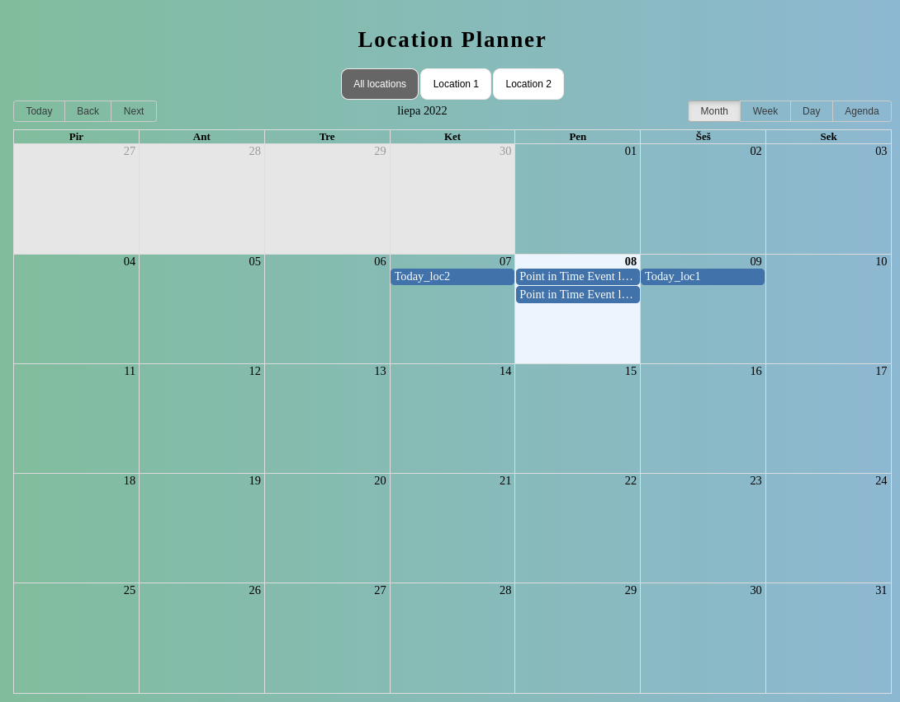
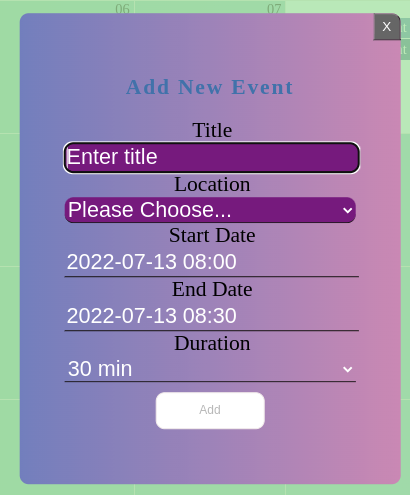
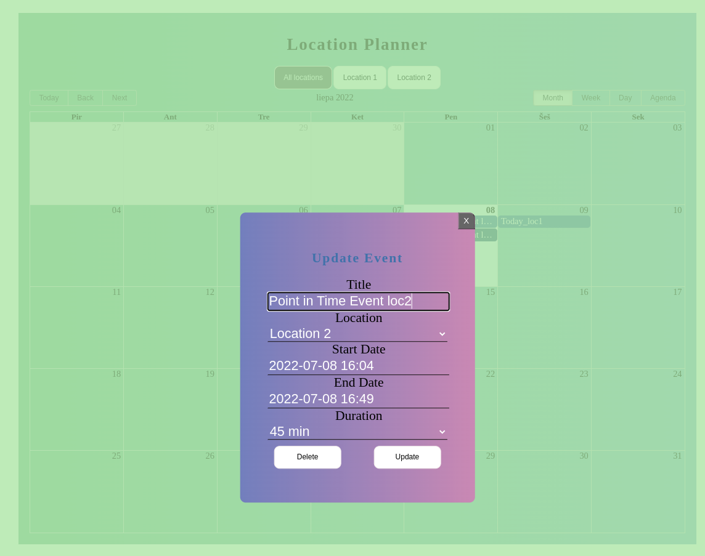
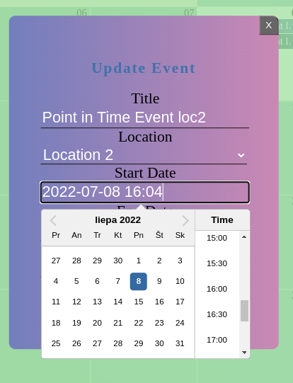

# Location calendar planner

Calendar with location appointment capabilities.

## Features

Built with: React (uses hooks and render props)

Styling: CSS and Styled Components

Testing (Beta): Cypress (e2e and component testing)

## Functionalities

- Calendar Event CRUD
- Calendar view by location
- Uses FakeApi with mock data
- Modal views

## Screenshots

<p align="center">
  
</p>
<p align="center">
  
</p>
<p align="center">
  
</p>
<p align="center">
  
</p>

## Instructions to start and test

```
$ git clone https://github.com/uoshvis/location-planner.git
$ npm install
$ npm start

# for tests: start dev server and

$ npm run test:cypress
```
